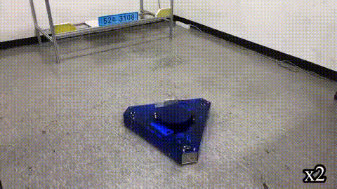
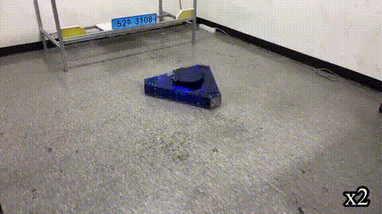
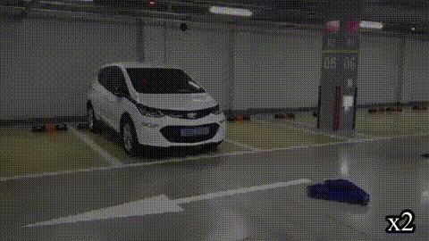

# 2021-Capstone-Design

광운대학교 로봇학부 2021년도 1학기 캡스톤 디자인 '로부스'팀 Repository입니다.  
개발 기간 : 2021.3 ~ 2021.6  

## 팀원 구성  

|팀원|맡은 역할|
|:---:|:---:|
|[김범수(팀장)](https://github.com/kimbeomso)| 전체 지휘 총괄 및 일정 조율, Fuzzy 제어기 Input 설계, 시연 환경 세팅 |
|[김태영](https://github.com/Taeyoung96)|Jetson 환경설정, Yolov3-tiny Training, Fuzzy 제어기 Input 설계, 무선 충전 모듈 제작|
|[정현민](https://github.com/jeong-hyeonmin)|하드웨어 설계, Fuzzy 제어기 설계, 하위 제어기 설계, 무선 충전 모듈 제작|
|[이창훈](https://github.com/changhun02)|Jetson 환경설정, 회로 설계 및 제작, 하위 제어기 설계 및 구현, Kinematics 해석|  

지도교수 : 광운대학교 로봇학부 [오정현](http://robotailab.net/) 교수님.  

## 작품 목표    

1. Omni Wheel(3개) 기반 모바일 로봇 제작  
2. Cascade 기반의 모터 속도 PI 제어기 설계  
3. Fuzzy를 이용한 상위 제어기 설계  
4. RGB-D 카메라 기반 Fuzzy 제어기 Input 설계  
5. 딥러닝 기반 번호판 검출 ([Yolov3-tiny](https://pjreddie.com/darknet/yolo/))      

## 작품 시연 영상  

- [작품 시연 영상 링크](https://drive.google.com/file/d/1VhgQszCi3qcgeaYeu4G26MKVO3VN6_wq/view?usp=sharing)  

  

 < 번호판을 Target으로 모바일 로봇 제어 >
  

  

< 차량의 무선 충전 모듈을 충전>
  

  

< 실제 차 번호판을 Target으로 모바일 로봇 제어 >
  

## ROS Package 설명  

### Jetson Xavier 환경설정  

|Library, Package 및 OS|Version|  
|:---:|:---:|  
|Jetpack|4.4.1|  
|ROS|Melodic|  
|Ubuntu|18.04|    
|CUDA|10.2|  
|CuDNN|8.0.0|
|OpenCV|4.1.1|
|PCL|1.8|  

### ROS Package 상세 설명

|ROS package 이름|Description|  
|:---:|:---:|  
|convert_2d_to_3d|Fuzzy 제어기 및 Yolov3 Bounding box 기반 Input Algorithm 설계|  
|darknet_ros|Yolov3와 ROS를 연동하기 위한 패키지|  
|joystick_drivers|옴니휠을 조이스틱으로 제어하기 위한 패키지|  
|omni_bot_msg|Omniwheel robot의 customized ROS message|  
|realsense-ros|Realsense 카메라를 ROS 연동을 하기 위한 패키지|  
|serial|serial 통신을 위한 ROS 패키지|  
|stm32_serial_comm|STM32와 Jetson Xavier 통신을 위한 패키지|  
|timed_roslaunch|로봇 작동에 필요한 launch 파일들을 한번에 작동시키기 위한 패키지|  
|vision_opencv|ROS와 OpenCV 연동을 위한 패키지|  

### How to start  

1. `realsense-ros` 패키지에서 Depth filtering을 적용, Point cloud를 먼저 publish한다.  
- `roslaunch realsense2_camera rs_rgbd.launch`    

2. `darknet-ros` 패키지를 활용하여 번호판 검출, Bounding box에 대한 좌표를 publish한다.  
- `roslaunch darknet_ros darknet_ros.launch`  

3. Bounding box 및 Point cloud를 기반으로 Fuzzy 제어기에 들어갈 Input 계산, Fuzzy 제어기를 통한 각 옴니휠에 들어갈 각속도 계산  
- `roslaunch convert_2d_to_3d control_input.launch`  

4. Seiral 통신을 활용한 각속도 값을 STM32로 전달  
- `roslaunch stm32_serial_comm total.launch`  

## Hardware Architecture  

 

## System Architecture  

 

 

## Reference  
- Darknet-ROS for OpenCV4 : [tom13133/darknet_ros](https://github.com/tom13133/darknet_ros)  
- Realsense ROS package : [IntelRealSense/realsense-ros](https://github.com/IntelRealSense/realsense-ros)  
- Serial : [serial ROS package](http://wiki.ros.org/serial)  
- Joystick for ROS : [joy ROS package](http://wiki.ros.org/joy)  
- Delay the launch of a roslaunch file : [timed_roslaunch ROS package](http://wiki.ros.org/timed_roslaunch)  
- ROS with OpenCV : [vision_opencv ROS package](http://wiki.ros.org/vision_opencv)
