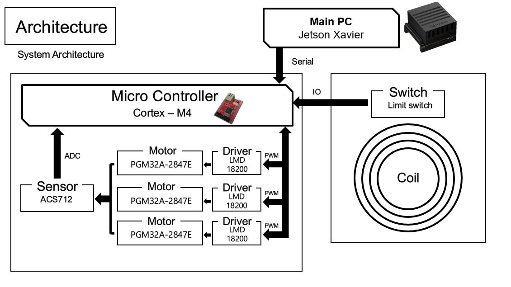

# 2021-Capstone-Design

광운대학교 로봇학부 2021년도 1학기 캡스톤 디자인 '로부스'팀 Repository입니다.  
개발 기간 : 2021.3 ~ 2021.6  

## 팀원 구성  

|팀원|맡은 역할|
|:---:|:---:|
|[김범수(팀장)](https://github.com/kimbeomso)| 전체 지휘 총괄 및 일정 조율, Fuzzy 제어기 Input 설계 |
|[김태영](https://github.com/Taeyoung96)|Jetson 환경설정, Yolov3-tiny Training, Fuzzy 제어기 Input 설계, 무선 충전 모듈 제작|
|[정현민](https://github.com/jeong-hyeonmin)|하드웨어 설계, Fuzzy 제어기 설계, 하위 제어기 설계, 무선 충전 모듈 제작|
|[이창훈](https://github.com/changhun02)|Jetson 환경설정, 회로 설계 및 제작, 하위 제어기 설계 및 구현, Kinematics 해석|  

지도교수 : 광운대학교 로봇학부 [오정현](http://robotailab.net/) 교수님.  

## 작품 목표    

1. Omni Wheel(3개) 기반 모바일 로봇 제작  
2. Cascade 기반의 모터 속도 PI 제어기 설계  
3. Fuzzy를 이용한 상위 제어기 설계  
4. RGB-D 카메라 기반 Fuzzy 제어기 Input 설계  
5. 딥러닝 기반 번호판 검출(Yolov3-tiny)  

## 작품 시연 영상  

## ROS Package 설명  

### Jetson Xavier 환경설정  

|Library, Package 및 OS|Version|  
|:---:|:---:|  
|Jetpack|4.4.1|  
|ROS|Melodic|  
|Ubuntu|18.04|    
|CUDA|10.2|  
|CuDNN|8.0.0|
|OpenCV|4.1.1|
|PCL|1.8|  

## Hardware Architecture  

 

## System Architecture  

 

 

## Reference  
- Darknet-ROS for OpenCV4 : [tom13133/darknet_ros](https://github.com/tom13133/darknet_ros)  
- Realsense ROS package : [IntelRealSense/realsense-ros](https://github.com/IntelRealSense/realsense-ros)  
- Serial : [serial ROS package](http://wiki.ros.org/serial)  
- Joystick for ROS : [joy ROS package](http://wiki.ros.org/joy)  
- Delay the launch of a roslaunch file : [timed_roslaunch ROS package](http://wiki.ros.org/timed_roslaunch)  
- ROS with OpenCV : [vision_opencv ROS package](http://wiki.ros.org/vision_opencv)
